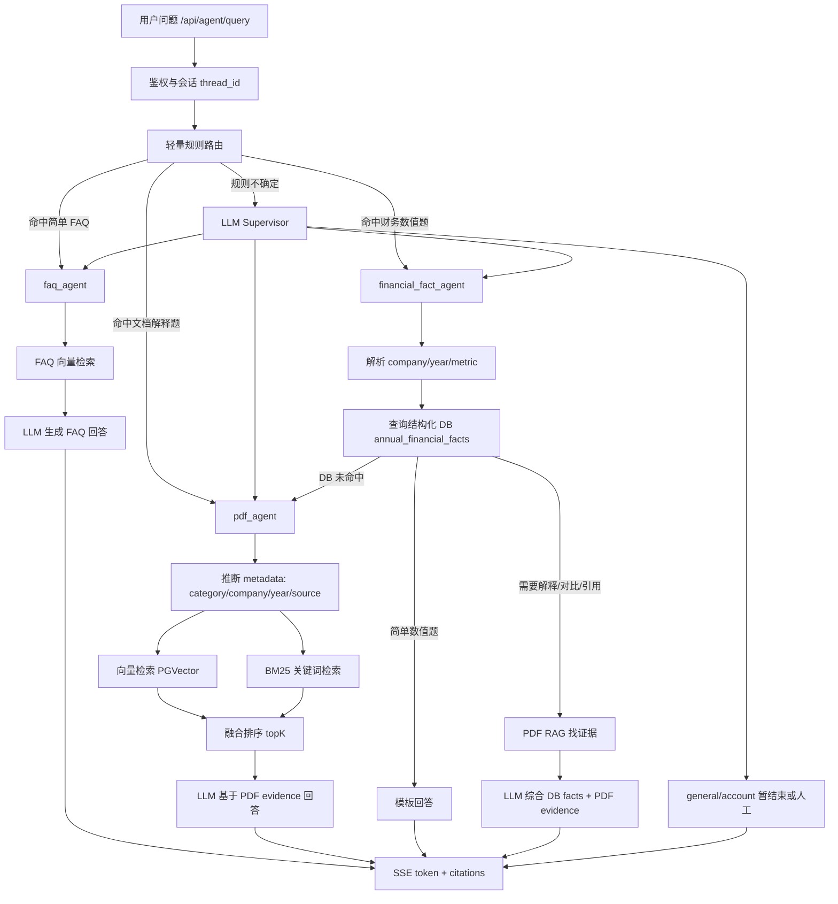

# RAG + DB 混合问答操作文档

## 整体流程图



## 目标

这套方案的目标不是让所有问题都走最复杂、最贵的链路，而是让系统按问题类型选择最合适的能力：

```text
DB 负责准确
RAG 负责依据
LLM 负责表达
规则/路由负责省成本
评测体系负责验证是否真的变好
```

最终希望达到：

- 普通金融知识问答走 `faq_agent`。
- PDF 文档解释、政策解读、研报观点走 `pdf_agent`。
- 年报财务数值、公司指标、年份对比走 `financial_fact_agent`。
- 简单问题尽量用规则、DB、模板解决。
- 复杂问题才调用 RAG 和 LLM。

## 为什么不把所有能力都塞进 pdf_agent

`pdf_agent` 的职责是处理非结构化文档问答，例如：

```text
年报如何描述主营业务？
政策文件提出了哪些措施？
研报怎么看 AI 算力行业？
```

而 DB 更适合回答结构化事实，例如：

```text
宁德时代 2024 年营业收入是多少？
寒武纪 2025 年研发费用是多少？
腾讯 2024 和 2025 年净利润分别是多少？
```

如果把 DB 查询直接塞进 `pdf_agent`，短期能跑，但长期会让职责混乱：

- PDF agent 既要做文档检索，又要做指标解析，又要做 SQL 查询。
- 数值题和解释题的评估口径不同，混在一起不好测试。
- 后续加入缓存、权限、审计、指标口径管理时会越来越难维护。

所以推荐单独做：

```text
financial_fact_agent
```

它负责结构化财务指标问答，但最终可以调用 LLM 润色，也可以调用 PDF RAG 找出处。

## 当前已有能力

### 1. /api/agent/query 入口

前端调用：

```text
POST /api/agent/query
```

后端入口：

```python
@router.post("/query")
async def agent_query(...)
```

主要流程：

```text
鉴权
生成或复用 conversation_id/thread_id
构造 HumanMessage
调用 LangGraph
通过 SSE 返回 token
最后返回 citations
```

### 2. LangGraph 主图

当前主图结构：

```text
START -> supervisor -> faq_agent / pdf_agent / END
```

建议下一步扩展为：

```text
START -> supervisor -> faq_agent / pdf_agent / financial_fact_agent / END
```

### 3. PDF 检索能力

当前 `pdf_agent` 已经具备：

```text
metadata 推断
向量检索
BM25 关键词检索
融合排序
LLM 生成回答
citations 返回
```

典型 metadata：

```text
category: annual_reports / policy / research_reports / industry_whitepapers / macro_research
company: CATL / TCEHY / 688256 / 688047
year: 2024 / 2025
source/doc_id/title
```

## 推荐企业级架构

### Agent 分工

```text
faq_agent
  处理 FAQ Markdown 知识库，适合短知识问答。

pdf_agent
  处理 PDF 文档库，适合解释型、依据型、政策/研报/白皮书问题。

financial_fact_agent
  处理结构化财务事实，适合公司、年份、指标、数值问题。

answer_synthesizer
  将 DB facts 和 RAG evidence 组织成自然语言答案。
```

### financial_fact_agent 推荐流程

```text
用户问题
  ↓
抽取 company / year / metric
  ↓
查询 annual_financial_facts
  ↓
DB 命中？
  ├─ 简单数值题：模板回答
  ├─ 需要解释/引用：PDF RAG 找 evidence，再让 LLM 润色
  └─ DB 未命中：fallback 到 pdf_agent
```

这样做的原因：

- DB 保证数值准确。
- PDF RAG 保证答案有出处。
- LLM 只负责表达，不负责猜数值。
- 简单问题不必调用 LLM，节省成本。

## 成本控制策略

企业级方案不是所有问题都跑：

```text
Supervisor LLM
DB
Vector
BM25
Reranker
LLM Answer
```

这样成本会很高。推荐分层：

### Level 0：规则和模板

适合：

```text
某公司某年某指标是多少？
```

如果规则能抽出：

```text
company
year
metric
```

并且 DB 命中，就直接模板回答。

示例：

```text
宁德时代 2024 年营业收入为 362,012,554 千元。
```

### Level 1：DB + 模板

用于简单财务数值题。

优点：

- 快。
- 便宜。
- 准确。

缺点：

- 表达较简单。
- 没有文档引用或解释。

### Level 2：DB + PDF evidence

用于需要引用出处的问题。

流程：

```text
DB 查值
PDF RAG 根据 company/year/metric/doc_id 查证据
模板或轻量 LLM 生成
```

### Level 3：DB + PDF evidence + LLM

用于复杂问题：

```text
对比宁德时代 2024 和 2025 年营业收入变化，并结合年报解释原因。
```

这类问题需要：

- 多个 DB facts。
- 多段 PDF evidence。
- LLM 组织总结。

### Level 4：Reranker / 更强模型

仅在以下情况使用：

- 检索结果置信度低。
- TopK evidence 不稳定。
- 问题高价值或高风险。

## 路由建议

### 规则优先

先用规则判断一部分问题，减少 LLM router 成本。

如果问题包含：

```text
营业收入
净利润
资产总额
资产负债率
研发费用
现金流
同比
某公司 + 某年份 + 某指标
```

优先走：

```text
financial_fact_agent
```

如果问题包含：

```text
年报如何描述
政策文件提出
研报认为
白皮书建议
报告中提到
```

优先走：

```text
pdf_agent
```

如果问题包含：

```text
T+1 是什么
基金定投是什么
涨跌停规则
交易时间
```

优先走：

```text
faq_agent
```

规则不确定时，再调用 LLM supervisor。

## 检索方案

### PDF RAG 检索

当前推荐：

```text
metadata filter
  ↓
PGVector 向量召回
  +
BM25 关键词召回
  ↓
融合排序
  ↓
TopK evidence
```

为什么要 metadata filter：

- 问年报时不查政策。
- 问 2024 时优先限定 2024。
- 问宁德时代时优先限定 CATL。
- 可以减少噪声，也减少 BM25 遍历范围。

为什么要 BM25：

- 向量检索擅长语义相似。
- BM25 擅长公司名、年份、指标名、政策编号、精确数字。
- 财务和政策问题里，关键词非常重要。

为什么后续可以上 ES/OpenSearch：

- 当前 `rank-bm25` 仍然需要遍历候选 chunk。
- ES/OpenSearch 在入库时建立倒排索引。
- 查询时直接通过索引找候选，不需要每次全量扫 chunk。
- 数据规模变大后，ES/OpenSearch 更适合生产。

## DB + RAG 答案生成

### Prompt 原则

给 LLM 的上下文应该分成两块：

```text
<db_facts>
公司：宁德时代
年份：2024
指标：营业收入
数值：362,012,554
单位：千元
来源文档：CATL Annual Report 2024
</db_facts>

<pdf_evidence>
[1] source=CATL_Annual_Report_2024.pdf page=...
主要会计数据表中列示营业收入为 362,012,554 千元...
</pdf_evidence>
```

Prompt 规则：

```text
1. DB facts 是最高优先级，数值不得改写。
2. 可以做单位换算，但必须保留原始数值和单位。
3. PDF evidence 只用于出处、解释和引用。
4. 如果 DB 与 PDF evidence 冲突，要说明冲突，不要自行判断。
5. 如果 DB 未命中，不要编造数值。
```

## 评估体系

不能只看 `top1_score`。企业级 RAG 要分层评估。

### 检索层

```text
Doc@K
Category@K
Relevant@K
EvidenceExact@K
Page@K
MRR
```

### DB 层

```text
EntityExtractAccuracy
MetricMatchAccuracy
SQLResultAccuracy
UnitAccuracy
```

### 答案层

```text
AnswerExact
Faithfulness
CitationAccuracy
Completeness
NoHallucination
Helpfulness
```

真正判断系统是否变好，要看：

```text
AnswerExact 是否提升
Faithfulness 是否提升
CitationAccuracy 是否提升
HallucinationRate 是否下降
```

## 推荐落地步骤

### 第一步：新增 financial_fact_agent

新增文件：

```text
app/agents/subgraphs/financial_fact.py
```

职责：

```text
抽取 company/year/metric
查询 annual_financial_facts
简单问题模板回答
复杂问题准备 DB facts 给 LLM
```

### 第二步：扩展状态和路由

修改：

```text
app/agents/states.py
app/agents/supervisor.py
app/agents/prompts/supervisor.py
app/agents/graph.py
```

新增 route：

```python
"financial_fact"
```

### 第三步：DB 命中后模板回答

先实现最低成本版本：

```text
DB 命中 + 简单数值题 -> 模板回答
DB 未命中 -> fallback pdf_agent
```

### 第四步：接入 PDF evidence

DB 命中后，用 DB 结果反查 PDF：

```text
category=annual_reports
company=...
year=...
source/doc_id=...
metric=...
```

拿到 evidence 后返回 citations。

### 第五步：复杂问题再 LLM synthesis

如果用户问：

```text
解释原因
进行对比
总结变化
结合年报说明
```

再调用 LLM。

### 第六步：建立端到端评测

新增：

```text
knowledge/eval/financial_fact_answer_eval.jsonl
```

记录：

```text
query
expected_company
expected_year
expected_metric
expected_value
expected_unit
expected_doc_id
expected_page
```

最终比较：

```text
纯 PDF RAG
DB + 模板
DB + PDF evidence
DB + PDF evidence + LLM
```

## 最终推荐形态

```text
简单问题：
  规则 -> DB/FAQ -> 模板/轻量回答

中等问题：
  metadata filter -> Vector + BM25 -> LLM

复杂财务问题：
  DB facts -> PDF evidence -> LLM synthesis

低置信问题：
  reranker -> 更强模型 -> 或人工
```

一句话总结：

```text
不要让 LLM 从 PDF 里猜数值。
让 DB 提供事实，让 RAG 提供证据，让 LLM 负责表达。
同时用规则、模板、缓存把成本挡在前面。
```
