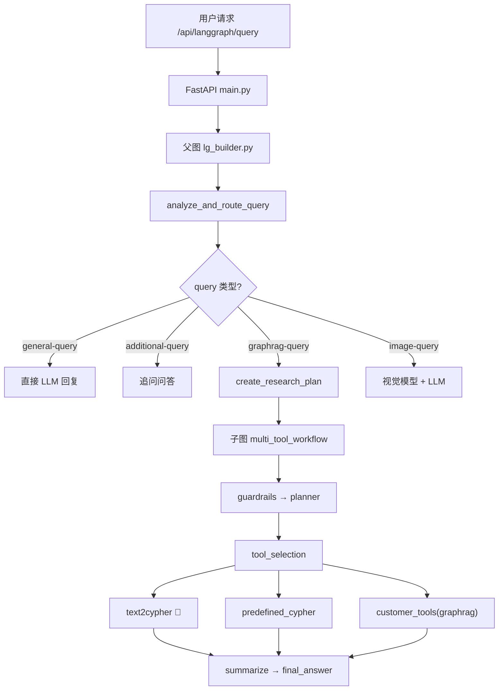
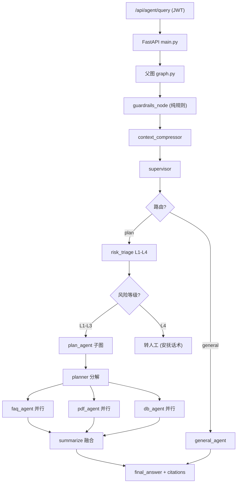

# AssistGen vs Fin-Agent-Platform 对比分析

> 本文档系统对比 `assistgen`（智能家居电商客服）与 `fin-agent-platform`（金融 Multi-Agent 智能客服）的架构设计、能力差异和改进方向。

---

## 一、项目定位对比

| 维度 | assistgen | fin-agent-platform |
|------|-----------|-------------------|
| **场景** | 智能家居电商客服 | 金融 Multi-Agent 智能客服 |
| **知识库** | Neo4j 知识图谱 | PGVector + 结构化 DB + BM25 |
| **核心查询** | Text-to-Cypher（图查询） | 向量检索 + 结构化 DB + 混合检索 |
| **LLM** | DeepSeek / Ollama 双通道 | 仅 DeepSeek |
| **前端** | 无独立前端（静态资源） | React + TypeScript + Tailwind |
| **鉴权** | 简单 user_id | JWT + 完整注册登录体系 |
| **持久化** | MemorySaver | Postgres Checkpoint |

---

## 二、架构总览对比

### 2.1 assistgen 架构



### 2.2 fin-agent-platform 架构



---

## 三、fin-agent-platform 已领先的优势 ✅

### 3.1 完整的安全防护体系

| 能力 | assistgen | fin-agent-platform |
|------|-----------|-------------------|
| JWT 鉴权 | ❌ 仅 user_id | ✅ 完整注册/登录/Token |
| Prompt 注入检测 | ❌ 无 | ✅ 正则黑名单（中英文） |
| PII 脱敏 | ❌ 无 | ✅ 身份证/银行卡/手机号 |
| 恶意内容过滤 | ❌ 无 | ✅ 敏感词过滤 |
| 风险分级 | ❌ 二值（通过/不通过） | ✅ L1-L4 四级风险 + 转人工 |
| Guardrails 实现 | ✅ LLM + Neo4j Schema | ✅ 纯规则（零 LLM） |

**关键差异**：assistgen 的 guardrails 依赖 LLM 判断（可能被绕过），fin-agent-platform 在请求进入 LLM 前就用纯规则完成拦截。

### 3.2 结构化 DB + RAG 混合问答

```python
# financial_fact_service.py — 精确查数
# 口语别名映射: "营收" → "营业收入", "宁德" → "CATL"
# SQL 精确查询 → 返回确切数值
```

| 能力 | assistgen | fin-agent-platform |
|------|-----------|-------------------|
| 结构化数值查询 | ❌ 全部走 Cypher | ✅ 专门 `FinancialFactService` |
| 口语别名映射 | ❌ 无 | ✅ 公司/指标别名 |
| RAG 解释性查询 | ❌ 全部 Cypher | ✅ FAQ + PDF 双通道 |
| DB 精确值兜底 | ❌ 无 | ✅ DB 未命中 → PDF RAG |

### 3.3 Map-Reduce 并行子图

```python
# plan_agent.py — Planner + Fanout + Summarize
# planner 将问题分解为 List[SubTask]
# List[Send] 并行分发到 faq/pdf/db_agent
# Annotated[List, add] reducer 自动归并
# summarize 融合多源证据
```

| 特性 | assistgen | fin-agent-platform |
|------|-----------|-------------------|
| 任务分解 | ✅ Planner 分解为子任务 | ✅ Planner + SubTask 模型 |
| 并行执行 | ❌ tool_selection 一次选一个 | ✅ List[Send] 多 Agent 并行 |
| 结果归并 | ❌ 无 reducer | ✅ Annotated[List, add] |
| 证据融合 | ✅ summarize 节点 | ✅ summarize 节点 |

### 3.4 上下文压缩

```python
# context_compressor.py
# 最近 K 轮完整保留 (K=4)
# 更早的压缩为 LLM 一句话摘要
# 阈值: >6 轮触发压缩
```

> assistgen 无此机制，长对话存在 token 超限风险。

### 3.5 混合检索 (Vector + BM25)

```python
# bm25.py — jieba 中文分词 + BM25Okapi
# retriever.py — Vector + BM25 融合排序
# filters.py — 从自然语言推断 category/company/year
```

| 特性 | assistgen | fin-agent-platform |
|------|-----------|-------------------|
| 语义检索 | ❌ 无 | ✅ PGVector + Embedding |
| 关键词检索 | ❌ 无 | ✅ BM25 (jieba 分词) |
| 混合检索 | ❌ 无 | ✅ Vector + BM25 融合 |
| 元数据过滤 | ❌ 无 | ✅ category/company/year/ticker |

### 3.6 Postgres Checkpoint 持久化

```python
# checkpoint.py — psycopg + langgraph-checkpoint-postgres
# 服务重启不丢失对话状态
```

> assistgen 使用 `MemorySaver`，重启后所有状态丢失。

### 3.7 完整测试体系

```
fin-agent-platform/tests/
├── test_checkpoint.py
├── test_clean_rules.py
├── test_db_agent.py
├── test_embedding.py
├── test_faq_agent.py
├── test_financial_fact_service.py
├── test_graph.py / test_pdf_agent.py
├── test_retrieval_filters.py / test_retriever.py
└── test_supervisor.py
```

> assistgen 的 `tests/` 目录几乎为空。

### 3.8 专业前端

| 特性 | assistgen | fin-agent-platform |
|------|-----------|-------------------|
| 框架 | 静态文件挂载 | React + TypeScript + Vite |
| UI 库 | 无 | Tailwind CSS + lucide-react |
| 登录页 | 无 | ✅ AuthPage |
| 聊天布局 | 无 | ✅ AppLayout |
| SSE 接收 | 无 | ✅ 流式 token + citations |

### 3.9 Docker Compose 一键部署

```yaml
# docker-compose.yml
services:
  postgres: pgvector/pg16  # 数据库 + 向量存储
  redis: redis:7            # 缓存
```

### 3.10 元数据过滤体系

```python
# filters.py
# infer_pdf_metadata_filters(query) → 从自然语言推断:
# - category: annual_reports / research_reports / policy ...
# - company: CATL / Tencent / Loongson ...
# - year, ticker, doc_id
```

---

## 四、fin-agent-platform 仍落后于 assistgen 的方面 ⚠️

### 4.1 错误兜底节点缺失

| assistgen | fin-agent-platform |
|-----------|-------------------|
| `error_tool_selection` 兜底节点 | 路由失败直接 `__end__`，用户无反馈 |
| 图结构内置错误处理边 | 无错误重试/回退机制 |

### 4.2 路由分类粒度不足

| 维度 | assistgen | fin-agent-platform |
|------|-----------|-------------------|
| 路由数 | 5 类 | 2 类 |
| 分类 | general / additional / graphrag / image / file | general / plan |
| 图片处理 | ✅ 视觉模型 (Vision API) | ❌ 无 |
| 文件处理 | ✅ 文件上传 + 索引 | ❌ 无 |

### 4.3 工具生态丰富度

```python
# assistgen 子图工具体系
tool_schemas = [cypher_query, predefined_cypher, microsoft_graphrag_query]

# fin-agent-platform
# 仅有: faq_retriever, pdf_retriever, financial_fact_service
```

| 工具 | assistgen | fin-agent-platform |
|------|-----------|-------------------|
| text2cypher | ✅ Few-shot 增强动态生成 | ❌ 无 |
| predefined_cypher | ✅ 预定义模板匹配 | ❌ 无 |
| GraphRAG | ✅ Microsoft GraphRAG | ❌ 无 |
| 结构化 DB | ❌ (全部 Cypher) | ✅ FinancialFactService |

### 4.4 Few-shot 示例检索增强

```python
# NorthwindCypherRetriever — assistgen 核心亮点
# 9 大类预存示例（产品/供应商/订单/员工/物流/客户/评价/统计/地理）
# 关键词匹配 top-K → 注入 LLM 提高 text-to-cypher 准确性
# TODO: 计划升级到 Embedding 余弦相似度
```

> fin-agent-platform 无此机制，LLM 生成 SQL/Cypher 时无示例引导。

### 4.5 多 LLM 双通道 fallback

```python
# assistgen — .env 中 AGENT_SERVICE 配置
if settings.AGENT_SERVICE == ServiceType.DEEPSEEK:
    model = ChatDeepSeek(...)
else:
    model = ChatOllama(...)
```

> fin-agent-platform 仅支持 DeepSeek，无可选 fallback。

### 4.6 实时文件索引通道

```python
# assistgen — IndexingService
# 上传文件 → 自动切块 → 向量化 → 入索引库
```

> fin-agent-platform 的 ingest 目前主要是脚本离线批处理，无实时上传索引 API。

---

## 五、技术栈详细对比

| 层次 | assistgen | fin-agent-platform |
|------|-----------|-------------------|
| **Web 框架** | FastAPI | FastAPI |
| **LLM** | DeepSeek / Ollama | DeepSeek |
| **视觉模型** | Vision API (OpenAI) | 无 |
| **图数据库** | Neo4j | 无 |
| **向量数据库** | 无 | PGVector |
| **结构化 DB** | 无 | PostgreSQL + asyncpg |
| **检索** | Cypher 查询 | Vector + BM25 混合 |
| **Agent 框架** | LangGraph StateGraph | LangGraph StateGraph |
| **持久化** | MemorySaver | Postgres + psycopg |
| **缓存** | 无 | Redis |
| **前端** | 静态文件 | React + Vite + Tailwind |
| **部署** | 手动启动 | Docker Compose |
| **认证** | 无/Auth 路由 | JWT + passlib |
| **测试** | 无 | pytest + pytest-asyncio |
| **分词** | 无 | jieba |

---

## 六、改进路线图

### 6.1 短期 (fin-agent-platform 可借鉴 assistgen 的)

| 优先级 | 改进项 | 参考来源 |
|--------|--------|----------|
| P0 | 错误兜底节点 | assistgen `error_tool_selection` |
| P0 | Few-shot 示例检索增强 | `NorthwindCypherRetriever` |
| P1 | 多 LLM fallback 支持 | assistgen `ServiceType` 双通道 |
| P1 | 预定义查询模板 | `predefined_cypher_dict` |
| P2 | 路由分类扩展 (image/file) | assistgen 5 类路由 |

### 6.2 中长期 (两者可互相参考的)

| 方向 | assistgen 可学 fin-agent-platform | fin-agent-platform 可学 assistgen |
|------|----------------------------------|----------------------------------|
| 安全 | 引入注入检测 + PII 脱敏 | — (已领先) |
| 检索 | 引入 Vector + BM25 混合 | — (已领先) |
| 持久化 | MemorySaver → Postgres | — (已领先) |
| 测试 | 补充完整测试 | — (已领先) |
| 工具 | — | 集成 Neo4j/GraphRAG 工具 |
| 多模态 | — | 补充图片/文件支持 |
| GraphRAG | — | 集成社区检测/全局检索 |

---

## 七、结论

> **fin-agent-platform 在企业级安全、混合检索架构、并行处理和工程化方面显著超越 assistgen；但在工具生态丰富度、多模态支持、Few-shot 增强和 LLM fallback 方面仍有追赶空间。**

两项目对同一套 LangGraph 模式（Planner → Fanout → Summarize）的落地路径不同：
- **assistgen** 先有丰富的工具生态（Cypher + GraphRAG），再往工程化方向演进
- **fin-agent-platform** 先做好工程底座（安全 + 检索 + 持久化），再丰富 Agent 工具生态

现有的 `docs/optimization_plan.md` 已规划了核心架构升级路径，且大部分能力（Planner + Fanout + Summarize + Guardrails）已完成落地。
