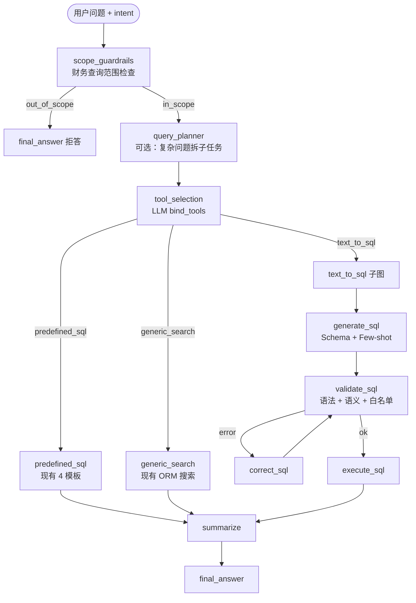

# fin-agent-platform SQL 改造方案（参照 AssistGen Text2Cypher 模式）

> 将 AssistGen `kg_sub_graph` 的 Text2Cypher 实现模式（Few-shot 检索、Multi-Tool 编排、生成→校验→修正→执行）迁移到 fin-agent-platform 的 `financial_query_agent` SQL 查询链路。

**关联文档：**

- [migration_plan_assistgen_style.md](../migration_plan_assistgen_style.md) — 目录结构与编码风格
- [financial_query_subgraph_refactor.md](./financial_query_subgraph_refactor.md) — 子图拆分早期计划
- [企业级财务事实查询与模板路由方案.md](../企业级财务事实查询与模板路由方案.md) — 模板路由设计
- AssistGen 参考实现：`assistgen/llm_backend/app/lg_agent/kg_sub_graph/`

---

## 一、现状 vs 目标

### 当前流程

```
extract_intent → template_sql_agent → [clarify | text_to_sql | END]
```

### AssistGen 对标流程

```
guardrails → planner → tool_selection(并行) → [cypher_query | predefined_cypher | graphrag] → summarize → final_answer
```

### 能力差距

| 能力 | AssistGen | fin-agent 现状 | 改造优先级 |
|------|-----------|---------------|-----------|
| Few-shot 示例检索 | `NorthwindCypherRetriever` | Text2SQL 无 | P0 |
| 生成→校验→修正→重试 | 最多 3 次 | 一次生成 + 执行层白名单 | P0 |
| 子图内 tool_selection | `bind_tools` 三选一 | 规则 + 结构化输出二选一 | P1 |
| 动态 Schema 注入 | `graph.schema` | Prompt 静态表名列表 | P1 |
| 通用搜索中间层 | GraphRAG | `generic_search_safe` 已实现但未接入 | P1 |
| SQL 结果 LLM 汇总 | summarize 节点 | `format_sql_answer()` 行拼接 | P2 |
| 子图内 planner | 任务分解 + Map-Reduce | 仅在 finance_agent 层 | P2（可选） |

### 保留不动（fin-agent 已更强）

- `EntityResolver` 实体消歧
- `FinancialSqlExecutor` 只读白名单校验
- 4 套参数化 SQL 模板（`FinancialSqlTemplateRegistry`）
- finance_agent 层 planner → Send 并行 worker

---

## 二、目标架构

在 `financial_query_agent` 内重构为 **AssistGen 风格 multi_tool 子图**，与上层 finance_agent 解耦：



### 设计原则

1. **模板优先**：与 AssistGen「predefined_cypher 优先于 text2cypher」一致；fin-agent 默认走 `predefined_sql`
2. **Text2SQL 兜底**：仅在前两层无法覆盖时启用
3. **安全不变**：最终执行仍走 `FinancialSqlExecutor.validate_readonly_sql()`
4. **渐进迁移**：新旧子图可开关切换，便于 A/B 对比和回滚

---

## 三、AssistGen → fin-agent 组件映射

| AssistGen 组件 | fin-agent 对应改造 | 说明 |
|----------------|-------------------|------|
| `NorthwindCypherRetriever` | `FinancialSqlExampleRetriever` | 财务 Q→SQL Few-shot |
| `BaseCypherExampleRetriever` | `BaseSqlExampleRetriever` | 抽象基类 |
| `create_text2cypher_generation_node` | `create_text_to_sql_generation_node` | Schema + Few-shot 生成 |
| `create_text2cypher_validation_node` | `create_text_to_sql_validation_node` | LLM + EXPLAIN 校验 |
| `create_text2cypher_correction_node` | `create_text_to_sql_correction_node` | 错误修正循环 |
| `create_predefined_cypher_node` | 复用 `template_sql/node.py` | 已有，改接口对齐 |
| `create_graphrag_query_node` | 接入 `generic_search_safe` | 已有服务，补节点 |
| `create_tool_selection_node` | 新建 `tool_selection/node.py` | bind_tools 四选一 |
| `create_guardrails_node` | 新建 `scope_guardrails/node.py` | 财务域范围检查 |
| `create_summarization_node` | 新建 `summarize/node.py`（子图内） | SQL 结果自然语言化 |
| `create_multi_tool_workflow` | 重构 `financial_query_agent/__init__.py` | 子图编排入口 |
| `cypher_dict.py` | 已有 `sql_templates.py` | 保持，统一导出 |
| `kg_tools_list.py` | 新建 `sql_tools_list.py` | Pydantic 工具 Schema |

---

## 四、目标目录结构

在现有 `financial_query_agent/` 下扩展，对齐 AssistGen 的「一节点一文件夹」：

```
app/agents/components/finance_agent/financial_query_agent/
├── __init__.py                    # create_multi_tool_sql_workflow()
├── sql_tools_list.py              # 工具 Schema 定义（新增）
├── state.py                       # InputState / OverallState / OutputState（新增）
├── edges.py                       # guardrails_conditional_edge 等（新增）
│
├── scope_guardrails/              # 新增：财务查询范围检查
│   ├── node.py
│   ├── prompts.py
│   └── models.py
│
├── query_planner/                 # 新增（可选）：复杂 SQL 子任务分解
│   ├── node.py
│   └── prompts.py
│
├── tool_selection/                # 新增：统一工具路由
│   ├── node.py
│   └── prompts.py
│
├── predefined_sql/                # 重构：由 template_sql/ 迁入/别名
│   ├── node.py                    # 复用现有 template_sql_agent 逻辑
│   └── prompts.py
│
├── generic_search/                # 新增：接入 generic_search_safe
│   └── node.py
│
├── text_to_sql/                   # 重构：拆成 generation/validation/correction/execution
│   ├── node.py                    # 编译子图入口
│   ├── prompts.py
│   └── utils.py                   # generate / validate / correct / execute
│
├── summarize/                     # 新增：SQL 结果 LLM 汇总
│   ├── node.py
│   └── prompts.py
│
├── final_answer/                  # 新增：子图最终输出
│   └── node.py
│
├── retrievers/                    # 新增：Few-shot 检索器
│   └── sql_examples/
│       ├── base.py
│       ├── financial_sql_retriever.py   # 对标 NorthwindCypherRetriever
│       └── vector_store/                # 二期：pgvector 向量检索
│           └── pgvector_sql_retriever.py
│
├── extract_intent/                # 保留：作为子图前置或并入 guardrails
│   └── ...
│
└── clarification/                 # 保留：tool_selection 路由到此
    └── ...
```

**服务层（`app/services/financial/`）基本不动**，节点层只做编排调用。

---

## 五、核心模块设计

### 5.1 Few-shot 检索器（P0）

**文件：** `retrievers/sql_examples/financial_sql_retriever.py`

参照 AssistGen `northwind_retriever.py`，按财务场景分类硬编码示例：

```python
all_examples = {
    "单指标查数": [
        {
            "question": "宁德时代2024年营业收入是多少",
            "sql": "SELECT ... WHERE ... :company_name ... :metric_name ... :years",
        },
    ],
    "同比对比": [
        {
            "question": "比亚迪2023和2024年净利润对比",
            "sql": "SELECT ... GROUP BY period_year ...",
        },
    ],
    "趋势分析": [
        {
            "question": "茅台近5年毛利率变化",
            "sql": "SELECT ... ORDER BY period_year ...",
        },
    ],
    "多公司对比": [...],
    "排名查询": [...],
}
```

**检索策略（一期）：** 关键词 + 类别匹配（与 AssistGen `NorthwindCypherRetriever` 相同）

**检索策略（二期）：** Embedding + pgvector，对接 `ingest/sql_examples/` 入库脚本

**注入位置：** `text_to_sql/prompts.py` 增加 `{fewshot_examples}` 占位符

```python
# 对标 AssistGen cypher_tools/prompts.py
"""
数据库 Schema：
{schema}

下面是一些问题和对应 SQL 的示例：
{fewshot_examples}

用户问题：{question}
"""
```

**调用链：**

```
text_to_sql/utils.py
  → cypher_example_retriever.get_examples(query=task, k=3)
  → text2cypher_chain.ainvoke({schema, fewshot_examples, question})
```

---

### 5.2 动态 Schema 注入（P1）

**文件：** `text_to_sql/utils.py` → `retrieve_schema_for_prompts()`

从 SQLAlchemy Model 或 `information_schema` 动态生成：

```python
def retrieve_schema_for_prompts() -> str:
    """从 fin_core 五张表生成 DDL 风格描述，注入 Text2SQL Prompt"""
    # 来源：app/models/annual_financial_fact.py
    # 输出：表名、列名、类型、JOIN 关系、常用 WHERE 条件
```

对标 AssistGen 的 `retrieve_and_parse_schema_from_graph_for_prompts()`。

**允许使用的表（与现有 Prompt 一致）：**

- `fin_core.annual_financial_facts`
- `fin_core.annual_financial_tables`
- `fin_core.annual_report_documents`
- `fin_core.financial_companies`
- `fin_core.financial_metrics`

---

### 5.3 Text2SQL 生成→校验→修正→执行（P0）

**文件：** `text_to_sql/utils.py`

| 步骤 | 实现 | 对标 AssistGen |
|------|------|----------------|
| generate | LLM + Schema + Few-shot → SQL JSON | `create_text2cypher_generation_node` |
| validate_syntax | `EXPLAIN` 或 `sqlglot.parse` | `validate_cypher_query_syntax` |
| validate_semantic | LLM 结构化输出 `ValidateSqlOutput` | `validate_cypher_query_with_llm` |
| validate_security | 复用 `FinancialSqlExecutor.validate_readonly_sql()` | 写操作拦截 |
| correct | LLM 根据 errors 修正，最多 3 次 | `create_text2cypher_correction_node` |
| execute | `FinancialFactService.run_generated_sql()` | `create_text2cypher_execution_node` |

**Text2SQL 子图内部流程：**

```
START → generate_sql → validate_sql
                          ├─ ok → execute_sql → END
                          ├─ error & attempts < 3 → correct_sql → validate_sql
                          └─ error & attempts >= 3 → END (返回错误信息)
```

---

### 5.4 工具选择层（P1）

**文件：** `sql_tools_list.py` + `tool_selection/node.py`

```python
# sql_tools_list.py — 对标 kg_tools_list.py
class predefined_sql(BaseModel):
    """单公司单指标精确查数、同比、趋势等标准财务查询"""
    query: str
    parameters: dict

class generic_search(BaseModel):
    """模糊/跨表/低置信度查询，使用安全 ORM 搜索"""
    query: str

class text_to_sql(BaseModel):
    """复杂多表 JOIN、自定义聚合、模板无法覆盖的查询"""
    task: str
```

**路由逻辑（对标 `tool_selection/node.py`）：**

```
LLM bind_tools → PydanticToolsParser
  ├─ predefined_sql  → predefined_sql 节点
  ├─ generic_search  → generic_search 节点
  ├─ text_to_sql     → text_to_sql 子图
  └─ 默认             → predefined_sql（模板优先）
```

**与现有 `FinancialQueryRouter.match_template()` 的关系：**

- **规则层保留**：`match_template()` 作为 tool_selection 前的 fast path
- **LLM 层增强**：规则未命中时再走 bind_tools

---

### 5.5 接入 generic_search（P1）

**现状：** `FinancialQueryRouter.route_generic_search()` + `FinancialFactSearchExecutor` 已实现，未进子图。

**改造：** 新增 `generic_search/node.py`，包装现有服务：

```python
async def generic_search_node(state):
    intent = state["financial_query_intent"]
    result = await fact_service.execute_query(intent)  # 已有
    return {"sql_results": result, "steps": ["generic_search"]}
```

在 tool_selection 中作为 **模板与 Text2SQL 之间的中间层**：

| 层级 | 适用场景 | 实现 |
|------|---------|------|
| predefined_sql | 结构化、高置信 | 4 套参数化模板 |
| generic_search | 模糊、跨字段 | ORM 安全搜索 |
| text_to_sql | 复杂、自定义 | LLM 生成 SQL |

---

### 5.6 Summarize + Final Answer（P2）

**现状：** `format_sql_answer()` 逐行拼接；finance_agent 层 summarize 负责多源融合。

**改造：** 在 SQL 子图内增加轻量 summarize，仅处理 SQL 结果：

```python
# summarize/prompts.py
"""根据查询结果，用自然语言回答用户问题。不要输出 SQL 或技术细节。"""
```

子图输出统一为 `{answer, sql_results, steps, history}`，finance_agent 层 summarize 继续做多 worker 融合。

**注意：** 避免重复 summarize — 子图 summarize 只做 SQL 结果格式化，多源融合留给 finance_agent。

---

## 六、与上层 finance_agent 的边界

```
finance_agent (不变)
  planner → Send(faq | pdf | financial_query | web_search)
  summarize (多源融合)
       │
       └── financial_query_agent (改造后)
             scope_guardrails → tool_selection → [predefined | generic | text2sql]
             → summarize → final_answer
```

**不在 SQL 子图内重复 planner：** 复杂问题分解仍由 finance_agent 的 `supervisor/planner` 负责。SQL 子图内的 `query_planner` 仅处理「单条 financial_query 任务需拆成多个 SQL 子查询」的场景（如「对比 A/B 两家公司近 3 年营收」），Phase 3 后再考虑。

---

## 七、分阶段实施计划

### Phase 0：基础设施（1-2 天）

| 任务 | 产出 |
|------|------|
| 新增 `state.py`、`edges.py`、`sql_tools_list.py` | 状态与工具 Schema 定义 |
| 新增 `retrievers/sql_examples/base.py` | 检索器抽象基类 |
| 新增 `retrievers/sql_examples/financial_sql_retriever.py` | 15-20 条财务 Q→SQL 示例 |
| 扩展 `text_to_sql/prompts.py` | 增加 `{schema}`、`{fewshot_examples}` 占位符 |
| Feature flag | `FINANCIAL_QUERY_V2=true` 切换新旧子图 |

### Phase 1：Text2SQL 增强（2-3 天）

| 任务 | 产出 |
|------|------|
| 实现 `retrieve_schema_for_prompts()` | 动态 Schema |
| 拆分 `text_to_sql/utils.py` | generate / validate / correct / execute |
| 实现 correction 循环（max_attempts=3） | 对标 AssistGen 重试 |
| 单元测试 | 覆盖生成、校验失败重试、安全拦截 |

### Phase 2：Multi-Tool 子图（2-3 天）

| 任务 | 产出 |
|------|------|
| 实现 `tool_selection/node.py` | bind_tools 路由 |
| 重构 `predefined_sql/` | 迁移 template_sql 逻辑 |
| 新增 `generic_search/node.py` | 接入已有 ORM 搜索 |
| 重构 `__init__.py` | `create_multi_tool_sql_workflow()` |
| 集成测试 | 三条路径端到端 |

### Phase 3：Guardrails + Summarize（1-2 天）

| 任务 | 产出 |
|------|------|
| 新增 `scope_guardrails/` | 财务域范围检查（非财报问题拒答） |
| 新增 `summarize/` + `final_answer/` | SQL 结果自然语言化 |
| 回归测试 | 对比新旧子图回答质量 |

### Phase 4：向量检索（可选，2-3 天）

| 任务 | 产出 |
|------|------|
| `ingest/sql_examples/` | 示例 embedding 入库 pgvector |
| `pgvector_sql_retriever.py` | 向量相似度检索 |
| 替换硬编码 retriever | 配置化切换 |

---

## 八、配置项建议

```env
# .env 新增
FINANCIAL_QUERY_V2=true                    # 启用新 multi_tool 子图
FINANCIAL_SQL_FEWSHOT_K=3                  # Few-shot 示例数量
FINANCIAL_SQL_MAX_ATTEMPTS=3               # Text2SQL 重试次数
FINANCIAL_SQL_RETRIEVER=keyword           # keyword | vector
FINANCIAL_SQL_LLM_VALIDATION=true         # 是否 LLM 语义校验
```

---

## 九、测试策略

| 测试文件 | 覆盖 |
|---------|------|
| `test_financial_sql_retriever.py` | Few-shot 检索相关性 |
| `test_text_to_sql_pipeline.py` | generate→validate→correct→execute |
| `test_tool_selection.py` | 三路工具路由 |
| `test_financial_query_agent_v2.py` | 端到端：template / generic / text2sql / clarify |
| 现有测试保持 | `test_financial_sql_executor.py` 安全校验不变 |

---

## 十、风险与注意事项

1. **不要削弱安全层**：LLM 校验是补充，`FinancialSqlExecutor` 白名单仍是最后防线
2. **模板路径保持默认**：与 AssistGen「默认 text2cypher，除非完全匹配」相反，fin-agent 应 **默认 predefined_sql**
3. **避免重复 summarize**：子图 summarize 只做 SQL 结果格式化，多源融合留给 finance_agent
4. **渐进切换**：Phase 0 就加 feature flag，新旧子图并行，便于对比和回滚
5. **Few-shot 质量**：示例需与 `fin_core` 真实 Schema 一致，建议从现有 4 模板 + 测试用例反推
6. **与早期计划的关系**：本方案在 [financial_query_subgraph_refactor.md](./financial_query_subgraph_refactor.md) 的四路分发基础上，补充 AssistGen 风格的 Few-shot、校验循环和 Multi-Tool 编排细节

---

## 十一、里程碑总结

| 阶段 | 核心交付 | 对齐 AssistGen 程度 |
|------|---------|-------------------|
| Phase 0 | Few-shot Retriever + Schema Prompt | 30% |
| Phase 1 | Text2SQL 校验修正循环 | 60% |
| Phase 2 | Multi-Tool 子图 + generic_search 接入 | 85% |
| Phase 3 | Guardrails + Summarize | 95% |
| Phase 4 | 向量检索（可选） | 100% |

**建议从 Phase 0 + Phase 1 开始**：投入小、收益大（Few-shot + 重试循环），且不影响现有 template 主路径。Phase 2 完成后再切 `FINANCIAL_QUERY_V2=true` 作为默认。

---

## 十二、AssistGen 参考文件索引

| 功能 | AssistGen 路径 |
|------|----------------|
| Few-shot 检索器 | `kg_sub_graph/agentic_rag_agents/retrievers/cypher_examples/northwind_retriever.py` |
| 检索器基类 | `kg_sub_graph/agentic_rag_agents/retrievers/cypher_examples/base.py` |
| Text2Cypher 生成 Prompt | `kg_sub_graph/agentic_rag_agents/components/cypher_tools/prompts.py` |
| 生成/校验/执行 | `kg_sub_graph/agentic_rag_agents/components/cypher_tools/utils.py` |
| Multi-Tool 工作流 | `kg_sub_graph/agentic_rag_agents/workflows/multi_agent/multi_tool.py` |
| 工具 Schema | `kg_sub_graph/kg_tools_list.py` |
| 预定义查询字典 | `kg_sub_graph/agentic_rag_agents/components/predefined_cypher/cypher_dict.py` |
| 工具选择节点 | `kg_sub_graph/agentic_rag_agents/components/tool_selection/node.py` |
| 主图入口 | `lg_agent/lg_builder.py` → `create_research_plan()` |
