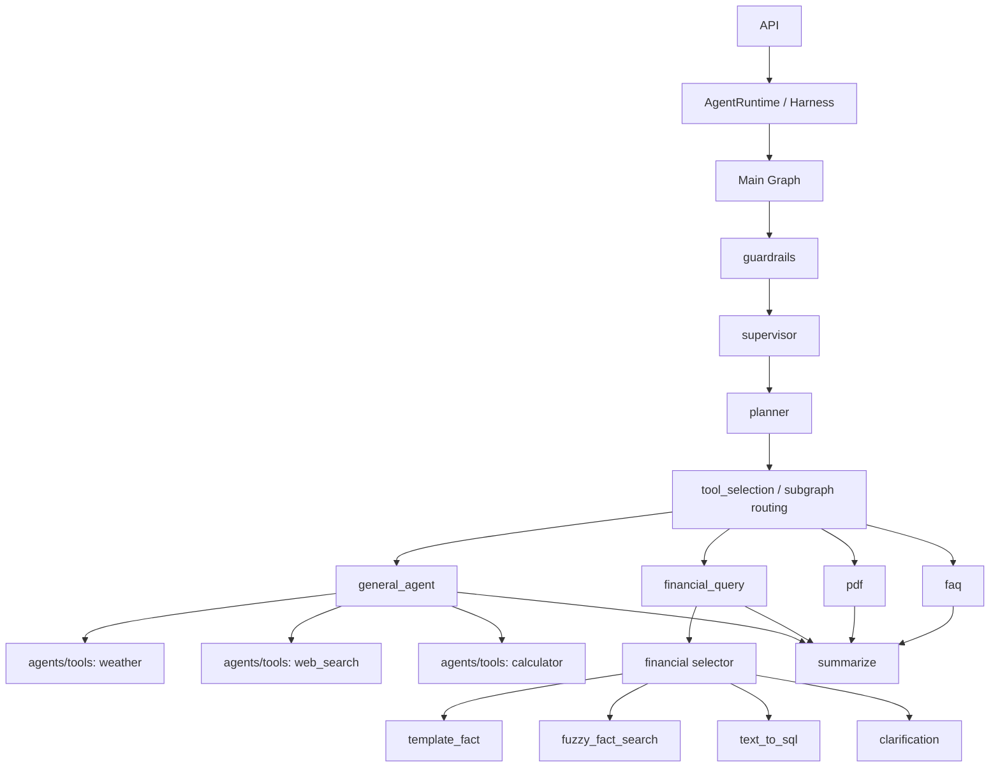

# 平台级 Harness 与工具边界设计

## 背景

随着 `fin-agent-platform` 从 FAQ / PDF 检索扩展到财务事实查询、天气查询、联网搜索、计算器等能力，系统里会同时出现两类容易混淆的“工具”：

- Agent 可直接调用的外部工具，例如天气、联网搜索、计算器。
- 金融查询域内部的执行策略，例如模板查询、模糊事实检索、text-to-SQL、澄清。

这两类能力的生命周期、注册方式、错误处理和可见边界都不同。如果把它们并列放进同一个工具注册中心，后续图编排、权限控制、测试和观测都会变得混乱。

本文档用于明确平台级 harness、Agent 外部工具层、金融领域内部策略层之间的边界。

## 核心结论

天气查询、联网搜索属于 `app/agents` 的外部工具层；模板查询、模糊事实检索、text-to-SQL 属于金融查询域内部策略层。两者都叫“工具”容易误导设计，结构上必须分开。

推荐收敛为：

```text
外部工具层：app/agents/tools
  weather
  web_search
  calculator

领域能力层：financial_query 内部
  template_fact
  fuzzy_fact_search
  text_to_sql
  clarification
```

## 分层原则

### 1. 平台级 Harness

平台级 harness 只负责统一运行入口、事件、错误、策略和图编排，不关心某个具体领域内部如何完成查询。

建议职责：

- 提供统一执行入口，例如 `run_turn` / `stream_turn`。
- 承载标准事件、错误语义、超时、重试、权限、风险策略。
- 调度主图和子图。
- 不直接感知金融模板、模糊检索、text-to-SQL 等内部细节。

### 2. Agent 外部工具层

外部工具是 Agent 可以通过 `bind_tools()`、`ToolNode` 或工具注册中心直接调用的能力。

典型示例：

- 天气查询
- 联网搜索
- 计算器
- 汇率查询
- 其他外部 API

建议放在：

```text
app/agents/tools/
  registry.py
  schemas.py
  weather.py
  web_search.py
  calculator.py
```

这层属于 `app/agents`，因为它服务于 Agent 的推理与行动循环。

### 3. 金融领域内部策略层

金融查询内部的模板、模糊检索、text-to-SQL 不应该注册成 Agent 外部工具。它们是 `financial_query_agent` 或金融查询子图内部的查询策略。

典型策略：

- `template_fact`
- `fuzzy_fact_search`
- `text_to_sql`
- `clarification`

建议放在：

```text
app/services/financial/
  fact_service.py
  entity_resolver.py
  query_router.py
  template_executor.py
  fuzzy_executor.py
  text_to_sql_executor.py
```

这层属于业务服务和领域逻辑，不应被外部工具 registry 直接暴露。

## 推荐目标结构

```text
app/
  api/
    agent.py

  runtime/
    harness.py
    events.py
    errors.py
    policies.py

  agents/
    graph.py
    states.py
    subgraphs/
      plan_agent.py
      faq.py
      pdf.py
      financial_query.py
      summarize.py
    tools/
      registry.py
      schemas.py
      weather.py
      web_search.py
      calculator.py

  services/
    financial/
      fact_service.py
      entity_resolver.py
      query_router.py
      template_executor.py
      fuzzy_executor.py
      text_to_sql_executor.py
    retrieval/
      ...
```

目录边界：

| 目录 | 职责 | 不应承担 |
|---|---|---|
| `app/runtime` | 统一执行入口、事件、错误、运行策略 | 具体业务查询策略 |
| `app/agents` | 图编排、路由、外部工具调用 | 金融事实查询内部实现 |
| `app/agents/tools` | 天气、联网搜索、计算器等外部工具 | 金融模板、模糊查询、text-to-SQL |
| `app/services/financial` | 金融查询领域逻辑 | Agent 工具注册和 bind_tools 细节 |

## 图编排原则

主图只做编排，不知道每个工具或领域能力的内部细节。



关键点：

- `plan_agent` 只路由到 agent / subgraph，不直接碰 service 细节。
- `financial_query` 对外是一个子图或领域 Agent，对内再选择模板、模糊检索、text-to-SQL。
- `general_agent` 或其他适合的 Agent 节点再挂天气、联网搜索、计算器等外部工具。
- 外部工具不感知金融内部模板。
- 金融内部模板也不注册成外部工具。

## 错误示例

不要把所有东西平铺到一个工具列表：

```text
tool_name =
  weather
  web_search
  template_fact
  fuzzy_fact_search
  text_to_sql
```

这种设计会把 Agent 可调用的外部工具与金融查询引擎内部策略混在一起，导致：

- Agent 能绕过 `financial_query` 的领域约束直接调用内部策略。
- 金融查询内部实现被迫暴露成平台协议。
- 权限、审计、错误处理和观测维度难以区分。
- 后续新增账户查询、行情查询、RAG 查询时 registry 语义继续膨胀。

## 推荐实施顺序

### 1. 先拆边界，不做大规模目录重构

当前下一步最重要的不是建设一个“统一大 registry”，而是先把边界拆清楚：

- 外部工具放到 `app/agents/tools/`。
- 金融查询策略放到 `app/services/financial/`。
- 主图和 `plan_agent` 只路由到 agent / subgraph，不直接调具体 service executor。

### 2. 收敛金融查询 Agent 命名

将 `db_agent` 的命名思路收敛为 `financial_query_agent` 或 `financial_query` 子图。

推荐语义：

```text
financial_query
  -> query_router
  -> template_executor
  -> fuzzy_executor
  -> text_to_sql_executor
  -> clarification
```

这样对外暴露的是“金融查询能力”，不是数据库细节。

### 3. 抽出金融内部执行策略

逐步把模板查询、模糊检索、text-to-SQL 从 `db_agent` 代码里抽到 `app/services/financial/`。

推荐先抽：

- `query_router.py`
- `template_executor.py`
- `fuzzy_executor.py`
- `text_to_sql_executor.py`

### 4. 新建外部工具层

另起 `app/agents/tools/`，专门放天气、联网搜索、计算器这类外部工具。

推荐先建：

```text
app/agents/tools/
  schemas.py
  registry.py
  weather.py
  web_search.py
  calculator.py
```

这层未来才是 `bind_tools()`、`ToolNode` 或 tool registry 管理的对象。

### 5. 最后再重构图

等边界稳定后，再把图结构逐步收敛为：

```text
planner
  -> tool_selection / subgraph routing
  -> capability executor / subgraph executor
  -> summarize
```

不要一开始就大拆目录或大改主图。

## 命名建议

| 概念 | 推荐命名 | 避免命名 |
|---|---|---|
| Agent 外部工具 | `agents/tools` | `capabilities/financial/external` |
| 金融查询入口 | `financial_query` | `db_agent` |
| 金融内部路由 | `query_router` / `selector` | `tool_selection` |
| 金融模板执行 | `template_executor` | `template_tool` |
| 金融模糊检索 | `fuzzy_executor` | `fuzzy_tool` |
| text-to-SQL 执行 | `text_to_sql_executor` | `sql_tool` |

## 设计判断

判断一个能力应该放在哪里，可以用以下规则：

| 问题 | 如果答案是“是” | 建议位置 |
|---|---|---|
| LLM Agent 是否可以直接决定调用它？ | 是 | `app/agents/tools` |
| 它是否依赖外部 API 或通用工具语义？ | 是 | `app/agents/tools` |
| 它是否只是金融查询内部的一种执行路径？ | 是 | `app/services/financial` |
| 它是否需要共享金融实体解析、指标字典、模板计划？ | 是 | `app/services/financial` |
| 它是否应该被 guardrails / planner 看成一个高层任务？ | 是 | `app/agents/subgraphs` |

## 最终原则

```text
app/agents：编排、路由、外部工具
app/services/financial：金融查询领域逻辑
app/runtime：统一运行入口、事件、错误和策略
```

平台 harness 可以统一调度多种能力，但不能把所有能力都压成同一种“工具”。外部工具、领域 Agent、领域内部策略要分别建模，才能保持架构清晰、权限可控、后续扩展不互相污染。
